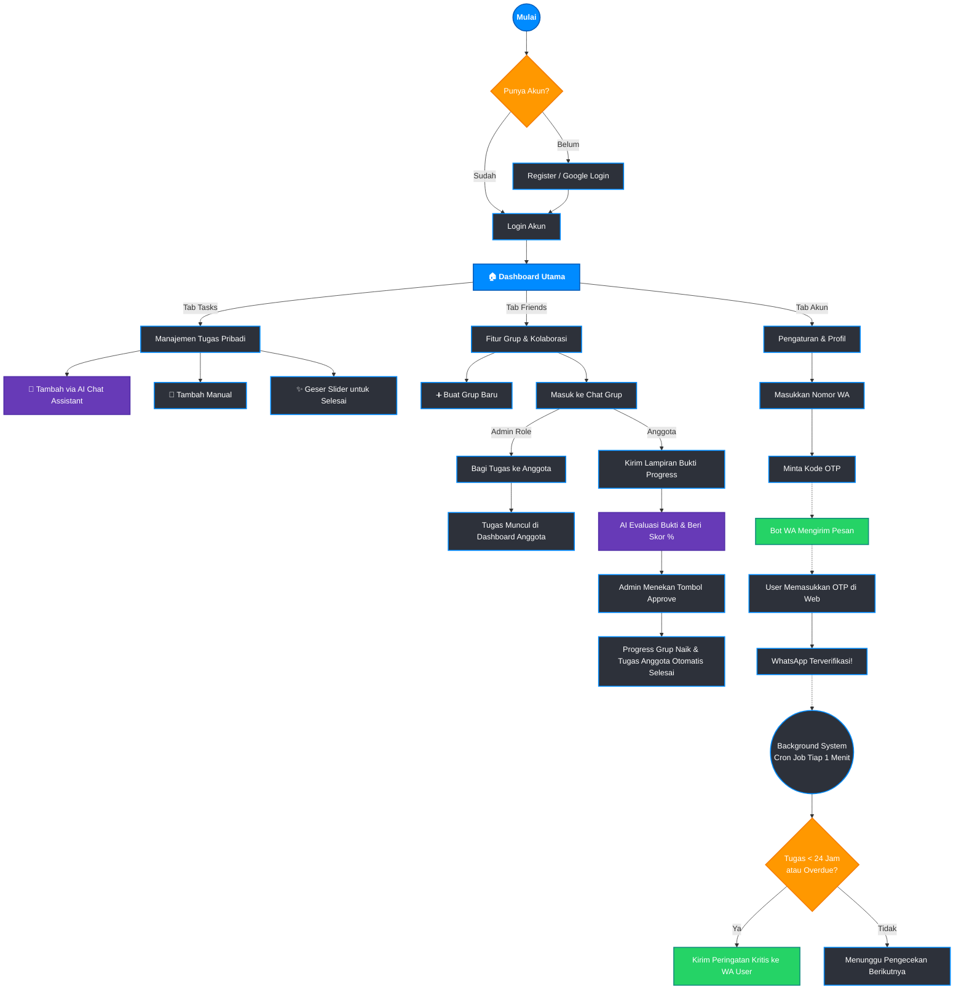

# 🌊 Tuntaz User Flow

Berikut adalah alur penggunaan (User Flow) lengkap dari aplikasi **Tuntaz**, mulai dari pendaftaran hingga fitur peringatan otomatis via WhatsApp.

---

### 📖 Penjelasan Detail Tiap Fase

#### 1. Autentikasi (Pintu Masuk)
Pengguna baru dapat mendaftar menggunakan Email/Password atau *One-Click Login* menggunakan akun Google. Jika sudah memiliki sesi (*token* tersimpan), pengguna akan langsung diarahkan ke Dashboard.

#### 2. Manajemen Tugas Pribadi (Personal Mode)
Ini adalah fungsi utama (inti) dari Tuntaz. 
- Pengguna bisa berbicara dengan AI Assistant (menggunakan Gemini API) di panel kanan untuk mendiktekan tugas-tugasnya. AI akan mengekstrak judul, tingkat kesulitan, dan *deadline*, lalu memasukkannya ke daftar tugas secara otomatis.
- Setelah selesai mengerjakan, pengguna cukup membuka kartu tugas dan menggeser *slider* (seperti membuka kunci layar) untuk menandai tugas tersebut sebagai selesai.

#### 3. Manajemen Tim / Kelompok (Group Mode)
Fokus pada tugas kolaboratif dan transparansi:
- **Admin Grup** dapat membagikan tugas spesifik ke anggota tertentu.
- Tugas tersebut akan muncul di *Dashboard* si anggota dengan lencana khusus (ikon grup warna biru). Anggota **tidak bisa** menyelesaikan tugas ini menggunakan *slider* biasa.
- **Workflow Penyelesaian:** 
  1. Anggota masuk ke Chat Grup dan mengunggah foto laporan kerja (*Upload Attachment*).
  2. AI akan menganalisis foto tersebut dan memberikan perkiraan *progress* (misalnya: "+25%").
  3. Admin mengeklik tombol **Approve**.
  4. Secara otomatis, sistem memperbarui *progress* keseluruhan grup DAN mencoret status tugas anggota tersebut menjadi "Selesai" di *dashboard* pribadinya.

#### 4. Notifikasi Bot WhatsApp
Sistem anti-lupa yang bertindak layaknya asisten proaktif:
- Pengguna mengatur nomor WhatsApp di menu Profil, lalu memvalidasinya menggunakan OTP.
- Sistem di *backend* (Node.js + `whatsapp-web.js`) terus berjalan di belakang layar. Setiap 1 menit, AI mengecek jika ada tugas (baik pribadi maupun kelompok) yang memiliki tenggat waktu kurang dari 24 jam.
- Jika ditemukan tugas kritis, bot WhatsApp akan segera mengirimkan *chat* peringatan (*Alert*) langsung ke HP pengguna agar tidak ketiduran.
